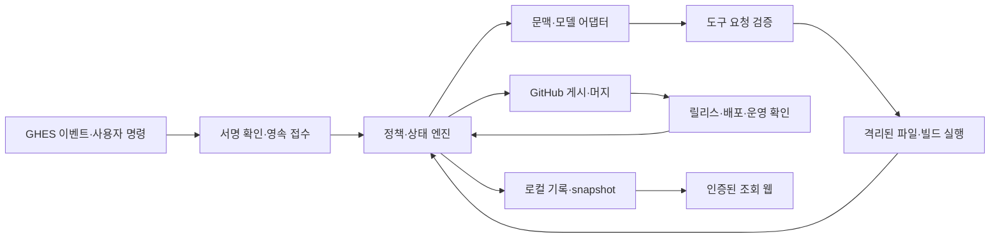

# AI-DLC Agent 상세 설계 D1 + 다중 모델 확장 D2

상태: 현재 합의에 기반한 구현 기준. 구현이나 실제 환경에서의 호환성 검증이 완료되었다는 의미는 아니다.

구현 상태: connection/repository/service 설정·readiness와 공통 HTTPS transport, 모델 선택, 요구사항/설계 승인·파일 저널/복구에 더해 로컬 source snapshot·command 실행/중단/복구·JUnit 검증을 구현했다. [README.md](README.md), [transport 구현 계약](TRANSPORT_IMPLEMENTATION.md), [작업 엔진](WORKFLOW_IMPLEMENTATION.md), [실행 구현 계약](EXECUTION_IMPLEMENTATION.md)에 실행 방법과 실제 미구현 범위를 기록한다. 외부 의존성이 없는 이 핵심 모듈은 immutable dataclass와 strict 검증 함수를 사용한다. 실제 HTTP 검증은 loopback TLS fixture, 프로세스 검증은 내장 합성 프로그램에 한정하며 FastAPI/Pydantic, 실제 API/운영 OS runner는 후속 작업이다.

## 1. 문서의 위치와 확정 범위

[DESIGN.md](DESIGN.md)는 요구사항과 기본 구조, 이 문서는 구현 구조와 인터페이스의 기준이다. [WORKFLOW_SPEC.md](WORKFLOW_SPEC.md)는 상태·사람의 명령·문서 관리, [RUNTIME_SPEC.md](RUNTIME_SPEC.md)는 저장·실행·복구·배포 계약을 정의한다. 상세 설계 D1에서 선택한 기술은 기본 설계의 이전 후보 목록을 대체한다. 사용자 합의가 최우선이며, 사내 API 규격을 추정해 확정하지 않는다.

[MULTI_MODEL_SPEC.md](MULTI_MODEL_SPEC.md)의 D2는 단일 모델 전제를 대체한다. provider·model registry, repository/목적별 routing과 session 경계를 추가하며 사내 종속 계약 확인은 이후로 미룬다. 그 외 D1의 상태·권한·운영 계약은 유지한다.

이번 설계의 제품 경계:

- 단일 설치 패키지, 단일 활성 Agent 인스턴스, 내장 webhook·웹 화면·작업 관리자. 별도 DB·Worker 서비스·메시지 브로커·Actions·컨테이너 없음.
- GHES GitHub App, repository별 Issue 접수와 정책, 직접 clone·빌드·테스트·PR·머지·배포·운영 피드백.
- Java 8·Maven·JUnit 우선. C#·Jira·Discussions·다중 호스트 HA는 현재 범위에 넣지 않는다.
- 요구사항의 원문과 revision 보존, 요구사항 승인 필수. 이후 설계 협의·시작·리뷰·머지·배포 관문은 정책으로 선택.
- 한 실행 Issue에 한 PR. 상위 Issue는 작업 조정·전체 인수 판정에 사용한다.
- 최종 설계와 구현 결과는 완결된 PR 본문, 지속할 ADR·KB는 Git에 보관한다.
- 운영은 내부 연결만, 명시적 테스트는 설정한 GPT API·외부 Maven 사용 가능. 허용 데이터 범위는 추후 결정하며 별도 분류 기능을 이번 설계에 넣지 않는다.

## 2. 기술 선택

| 영역 | D1 선택 | 이유·검증 경계 |
| --- | --- | --- |
| 구현 언어 | CPython 3.12 계열 | asyncio·파일·프로세스·HTTP 중심의 단일 코드베이스. 정확한 patch와 native 의존성은 내부 빌드 검증 후 고정 |
| HTTP | FastAPI + Uvicorn, worker 1개 | webhook·웹·조회 API를 같은 앱에 제공. 다중 worker로 중복 scheduler를 만들지 않음 |
| 자료 검증 | 핵심은 strict 검증 함수·immutable dataclass, 설정은 JSON; 후속 HTTP 경계에 Pydantic 2 계열 | 중복 key·알 수 없는 필드·묵시적 자료형 변환 거부, 명시적 schema_version |
| 통신 | 현재 표준 라이브러리 socket/ssl/http.client 경계; 후속 adapter에서 교체 가능 | GHES·모델 공통 정책. 정확한 host/port·DNS CIDR·TLS/CA·timeout·응답 제한 적용, 환경 proxy/redirect/fallback 금지 |
| App 서명 | PyJWT + cryptography | 자체 암호 구현 배제. 설치별 native 호환성 검증 필요 |
| 웹 | Jinja2 + 번들 CSS·작은 JavaScript | SSR 목록·상세와 SSE 갱신. CDN·별도 frontend 서버 없음 |
| 작업 엔진 | 명시적 Python 상태 전이 + asyncio scheduler | 승인과 실행 판단을 LLM에 맡기지 않음 |
| 코딩 Agent | 직접 구현하는 제한된 tool loop | provider 차이를 어댑터에 가두고 실행 권한·문맥·재시도 제어 |
| 파일 상태 | JSON snapshot + 개별 JSON event/intent 파일 | DB 없음, 단일 writer, 파일 교체와 재조정으로 복구 |
| 검증 | 현재 표준 unittest와 loopback TLS/합성 프로세스, 후속 pytest·실제 API/OS 시험 | 실제 Gemma·GHES·RHEL 시험과 구분 |
| 설치 | OS·CPU별 offline tar.gz, systemd 단일 서비스 | 앱 전용 runtime 포함, 사내 Maven artifact로 공급 |

OpenHands·LangGraph·LangChain은 D1 필수 의존성에서 제외한다. 검증되지 않은 SDK에 권한·복구·상태의 책임을 추가하지 않는다. Git·JDK·Maven·OS 제어 도구는 승인된 별도 toolchain 경로를 사용한다.

위 선택은 최신 버전·지원 OS에 대한 외부 조사 결과가 아니다. RHEL 7·8·9 각 환경에서 CPython·OpenSSL·cryptography·HTTP stack을 실제로 빌드·설치·시험한다. 특히 RHEL 7용 runtime 공급 가능성은 배포 차단 조건이다. 한 OS에서 빌드한 binary나 wheel의 호환성을 가정하지 않으며, 실패하면 언어/런타임 변경을 설계 변경으로 기록한다. 호환성 미확인을 이유로 오래된 시스템 Python으로 조용히 전환하지 않는다.

## 3. 애플리케이션 구성

```text
ai_dlc/
  app.py                    # startup/shutdown, 단일 인스턴스 잠금
  domain/                   # Task, Revision, Approval, Run, Release, 상태 전이
  application/              # ingest, advance, amend, reconcile, publish
  github/                   # App 인증, webhook 변환, GitHub 게시·권한 조회
  models/                   # 공통 DTO, provider/model registry, routing, protocol adapters
  agent/                    # 문맥 구성, 정리·설계·코딩 loop, tool schema
  repositories/             # 규칙 수집, execution profile, Java 프로젝트 해석
  execution/                # workspace, 제한된 실행 요청, 결과 수집
  deployment/               # release/배포/정상 확인/rollback 어댑터
  storage/                  # 파일 journal, snapshot, intent, 잠금, migration
  web/                      # 사용자 인증, 조회 API, SSE, templates, static
  config/                   # strict config load, 참조 해석, policy validation
  evaluation/               # 사례 실행, 독립 평가 연결, 지표·관문·보고서
  cli.py                    # serve, validate-config, doctor, backup, migrate, eval
launcher/                   # 같은 패키지의 제한된 OS 실행 helper
tests/                      # 도메인·복구·계약·통합·인수 시험
```

`domain`은 HTTP·LLM·filesystem에 의존하지 않는다. `application`이 ports를 통해 어댑터를 호출한다. 웹·GitHub 댓글 게시기는 동일 snapshot을 읽는다. 웹에서 작업을 변경하는 API는 제공하지 않는다.



## 4. 식별자와 자료 계약

UTC RFC3339 시각, UUID 실행 식별자, GHES instance ID + numeric repository ID를 사용한다. repository 이름 변경으로 작업이 새로 생기지 않는다. commit ID는 Git이 반환한 전체 값을 보존하며 고정 길이를 임의 가정하지 않는다. digest는 SHA-256이다.

원본 body digest는 받은 UTF-8 byte에 대해 계산한다. 구조화한 DTO/config digest는 secret 참조 이름만 포함한 JSON을 key 정렬·공백 제거·UTF-8로 직렬화한 값으로 정의한다. 시각/숫자 정규화는 schema가 담당하며 NaN/Infinity를 허용하지 않는다. 두 digest의 용도를 섞지 않는다.

| 형식 | 필수 내용 |
| --- | --- |
| TaskKey | instance_id, repository_id, issue_number |
| Task | schema_version, task_key, kind(execution/parent), state_revision, phase, status, requirement_revision, design_revision, effective_policy_digest, dependencies, run_id, pr_number, next_action, waiting_reason, updated_at |
| RequirementRevision | revision_id, source_event_ids, 원문 blob 참조·digest, 목적·범위·인수 조건, 미결 질문, 분리안, 이전 revision, 내용 digest |
| DesignRevision | revision_id, requirement_revision, 규칙 snapshot, 변경 영역·인터페이스·검증·배포 계획, 결정과 가정, 이전 revision, digest |
| Approval | approval_id, gate, actor_id, 원본 comment/review ID·digest, 정확한 target revision/head/release, 권한 조회 근거, created_at, revoked_at |
| ExecutionProfile | 기준 commit, rule sources(path/API·digest), JDK·Maven·명령 ID·보고서 경로, 한도, network profile, 승인된 override 근거 |
| Run | run_id, attempt, task_key, 입력 revision/digest, base/head/tree, toolchain digest, start/end, 단계별 결과, 종료 이유 |
| ToolInvocation | invocation_id, run_id, provider_call_id, tool_name, input_digest, expected_workspace_digest, cancellation_epoch, intent/result 참조, observed_effect |
| ArtifactManifest | release_id, merge_commit, source_tree, 빌드 run_id, 파일 경로·크기·digest, 시험 결과, build/toolchain/config digest |
| EffectIntent | effect_id, type, task_key, target, input_digest, expected_remote_state, planned/confirmed/uncertain/failed, remote_ref |
| DeploymentRecord | deployment_id, release_id, environment, artifact_digest, 이전 release, 외부 operation ID, 관측 상태, health/rollback 근거 |

공통 오류 형식은 `code, retryable, effect_state(none/confirmed/unknown), safe_message, evidence_ref`다. 원본 인증 header·secret을 오류에 포함하지 않는다. 버전이 다른 DTO를 묵시적으로 해석하지 않는다.

표시 상태와 승인 근거는 분리한다. `state_revision`은 낙관적 갱신 검사에 사용한다. 승인 토큰은 사람이 이해할 수 있는 `req-0003`·`des-0002`·`rel-<id>` 형태이며, 실제 처리는 TaskKey와 내용 digest까지 결합한다.

## 5. 내부 인터페이스

비동기 I/O는 async, 상태 전이는 순수 함수로 구현한다. 아래 이름은 구현 계약이며 외부 API URL을 의미하지 않는다.

| Port | 주요 호출과 결과 |
| --- | --- |
| StateMachine | `decide(task, event, facts) -> Transition(new_state, intents)`; 사실 부족이면 대기, 임의 외부 효과 없음 |
| StateStore | `load_task(key)`, `commit(expected_revision, event, new_state, intents)`, `pending_effects()`, `replay(key)` |
| GitHubPort | `get_issue`, `list_comments`, `get_pr`, `get_actor_access`, `get_rules`, `publish_comment`, `ensure_pr`, `publish_check`, `merge(expected_head)` |
| ModelPort | `generate(ModelRequest) -> ModelResponse`; provider별 message/tool protocol 정규화 |
| ModelRouter | `resolve(repo_policy, purpose, config_revision) -> ResolvedModel`; 등록된 model·권한·필수 기능 검사 |
| ContextBuilder | `build(task, purpose, budget) -> ContextBundle(sources, messages, tools, omissions)` |
| WorkspacePort | `prepare(repo, base_commit, run)`, `read/search/apply_patch`, `capture_tree`, `export_changes` |
| ExecutionPort | `start(ExecutionRequest) -> handle`, `status(handle)`, `terminate(handle) -> observed_result` |
| ProjectPort | `discover(tree) -> profile_proposal`, `build`, `test`, `collect_artifacts` |
| DeploymentPort | `plan`, `apply(effect_id, release, target)`, `inspect`, `verify`, `rollback`, `inspect_rollback` |
| IdentityPort | `authenticate`, `repository_access(user, repo)`, `logout` |
| ReadModel | `list_repositories`, `list_tasks`, `get_task`, `get_run`, `read_log_range`, `events_after` |

`GitHubPort`의 변경 호출과 `DeploymentPort.apply/rollback`은 durable intent를 기록한 이후에만 호출한다. `ensure_pr`은 기존 연결을 찾는 동작이며 네트워크 실패를 무조건 재생성으로 바꾸지 않는다.

## 6. 모델과 코딩 loop

`ModelRequest`: request_id, task/run/purpose, model_session_id, resolved_model_ref, ordered messages, tool definitions(JSON Schema), response constraints, timeout, output budget, cancellation token. `ModelResponse`: text, tool_calls(id/name/arguments), finish_reason, usage(optional), provider_request_id(optional). 사용량이 없으면 null로 기록한다. 목적별 선택과 모델 변경 시 문맥 재구성·예산 합산은 MULTI_MODEL_SPEC.md를 따른다.

진행 순서:

1. 승인된 요구사항·최신 유효 설계·규칙·관련 파일·최근 검사 실패로 문맥 구성.
2. 해당 단계에서 허용된 도구만 모델에 전달.
3. 응답의 도구 이름·인자·크기·호출 ID를 검증. 잘못된 출력은 최대 2회 교정 요청 후 `MODEL_PROTOCOL_ERROR`로 대기.
4. 실행 직전 승인·중단 요청·scope·기준 revision을 다시 확인.
5. 도구를 실행하고 결과를 정규화·정제하여 해당 호출 ID에 반환.
6. 실행 근거로 완료 조건 판정. 모델의 '완료' 문장은 완료 근거가 아님.
7. 한도 도달 시 checkpoint와 현재 변경·미결 내용을 남기고 사람 응답 대기. 자동으로 같은 예산을 새로 발급하지 않음.

| 도구 | 허용 범위 |
| --- | --- |
| list_files / search_text / read_file | 현재 작업 공간의 상대 경로, 크기·범위 제한, symlink 탈출 차단 |
| apply_patch | 승인 이후 현재 작업의 파일만, 수정 전 digest 확인, 원자적 교체 |
| inspect_diff | 기준 tree와 현재 작업 tree의 차이 |
| run_command | 승인된 execution profile의 command_id + 검증된 typed arguments; 임의 shell 문자열 금지 |
| test_report | 현재 실행에서 수집한 보고서 요약·근거 |
| request_clarification | 질문 후보 생성; 상태 전이와 실제 댓글 게시는 프로그램 책임 |

모델 도구에 GitHub 승인·직접 push·merge·deploy·secret 읽기·임의 HTTP 요청을 제공하지 않는다. 필요한 새 명령은 실행 프로필 변경 제안으로 제출한다. Maven·프로젝트 스크립트 자체도 코드를 실행하므로 격리된 계정에서 실행한다. 조회 shell도 제어 계정에서 실행하지 않는다.

서로 독립적인 읽기 도구만 동시에 실행한다. 파일 변경·빌드·테스트는 workspace별 직렬화한다. 모델이 같은 ID를 다른 인자로 재사용하면 오류, 같은 호출을 재전달하면 저장한 결과를 확인하며 실행을 중복시키지 않는다.

모델명이 아닌 프로토콜별 어댑터(openai_chat_completions/openai_responses/custom)를 등록한다. 내부 OpenAI 호환 API도 동일한 검증된 adapter를 사용할 수 있다. 사내 wire protocol 확인은 현재 선행 조건에서 제외하고 [MODEL_API_CONTRACT.md](MODEL_API_CONTRACT.md)에 후속 연결 절차로 남긴다. 현재 문서는 어떤 모델의 실제 도구 호환성이나 최신 SDK 지원을 주장하지 않는다.

## 7. 긴 대화·지식·문맥 관리

- Issue에 Agent 소유의 현재 상태 댓글 1개를 갱신하고, 원문·요구사항 revision·설계 revision·승인 처리 기록은 새 기록으로 추가한다.
- 대화 요약은 예를 들어 처리되지 않은 댓글 20개 또는 설정된 문맥 예산 초과 시 생성한다. 요약은 source comment IDs·digest와 열린 질문 목록을 가진다. 원문을 삭제하지 않는다.
- 문맥은 유효 요구사항/설계/정책을 우선 고정하고, 관련 ADR·KB, 관련 코드, 최근 대화·실패 결과 순으로 구성한다. 전체 Issue를 매번 그대로 전송하지 않는다.
- 요약은 탐색 자료다. 승인·취소·범위 변경은 원본 이벤트와 현재 권한으로 판정한다. 생략 자료와 원문 링크를 기록하고 모델에는 미확인 사항을 미확인으로 전달한다.
- 모델 문맥 한도는 어댑터 capability/config로 제공한다. 출력·도구 결과 여유를 예약하고, tokenizer가 없으면 보수적인 길이 제한과 요청 오류 처리를 쓴다. 정확한 token 수라고 표시하지 않는다.
- ADR·KB는 repository 내 기존 위치를 우선 사용한다. 없으면 repository profile의 경로를 사용한다. 별도 vector DB 없이 파일명·제목·키워드·참조 관계 검색으로 시작한다.
- 사실 발견은 출처 파일·commit·검증 결과와 함께 PR 변경으로 제안한다. ADR을 만들 중요한 결정이 없으면 빈 ADR을 생성하지 않는다.
- repository 간 문맥·검색 결과·메모리는 공유하지 않는다. 명시적으로 관리자가 등록한 공통 내부 지식 경로만 별도 읽기 scope로 추가할 수 있다.

## 8. GHES 연결 계약

### 8.1 App과 이벤트

App 설치 범위와 등록된 repository profile의 교집합만 처리한다. 승인된 repository의 새 사람 Issue를 기본 접수 대상으로 한다. 자동 생성된 운영 피드백 Issue는 Agent가 직접 intake event를 남기고 요구사항 승인 단계로 보낸다. bot 댓글·PR용 Issue 이벤트·지원하지 않는 이벤트는 새 요구사항으로 재처리하지 않는다.

필요 권한의 논리적 범위:

| 범위 | 사용 |
| --- | --- |
| metadata 읽기 | repository 식별 |
| issues 읽기/쓰기 | 접수·댓글·상태·하위 작업·완료 |
| contents 읽기/쓰기 | 코드 읽기와 작업 브랜치 push |
| pull requests 읽기/쓰기 | PR 생성·본문·리뷰 조회·정책에 따른 merge |
| checks 또는 commit statuses 쓰기 | 직접 실행한 검사 결과 게시 |
| 정책·팀 구성 조회 | 실제 규칙·권한 확인에 필요한 읽기만 |

관리 권한으로 branch protection을 수정하지 않는다. GHES가 어떤 규칙 조회에 별도 권한을 요구하는지 확인하고 최소 읽기 권한을 명시한다. App이 접근할 수 없는 보호 규칙을 '없음'으로 처리하지 않는다. 필요 권한과 API 사용 가능성은 capability manifest에 기록한다.

이벤트 대상은 issues, issue_comment, pull_request, pull_request_review, pull_request_review_comment, push, installation 및 설치 repository 변경을 기준으로 한다. 정확한 event action과 지원 기능은 GHES 확인 후 manifest에 고정한다.

### 8.2 접수 절차

1. 최대 body 5 MiB, 요청 read timeout 10초를 초기값으로 적용. 서명은 parsing 전 원본 body로 검증한다.
2. delivery ID·서명·App 설치·repository 범위를 확인. 재전송은 instance + delivery ID로 중복 판정한다.
3. 필요한 원본 payload와 digest를 영속 inbox에 기록·fsync한 뒤 202 응답. 디스크 오류는 503, 서명 오류는 401, 크기 초과는 413.
4. scheduler가 처리 시점의 Issue·댓글·권한·PR 상태를 다시 조회한다. webhook payload만으로 승인·머지를 결정하지 않는다.
5. webhook 유실은 지원되는 delivery 이력 및 등록된 repository의 제한된 주기 재조회로 보정한다. 과거 원문이 사라진 경우 복원되었다고 주장하지 않는다.

App JWT·installation token은 제어 프로세스가 필요 시 획득한다. 키는 권한이 제한된 외부 파일, token은 메모리에 보관한다. clone/push에는 최소 repository 범위의 단기 token을 제어된 Git 경로에서만 전달하며 URL·Git config·로그·runner 환경에 남기지 않는다.

### 8.3 기능 차이

하위 Issue API가 없으면 본문 링크·체크리스트와 로컬 parent/child 관계를 사용한다. Checks 미지원이면 등록된 commit status context를 사용한다. 필요한 branch 검사를 게시할 경로가 없으면 운영 도입을 막는다. Draft PR 지원이 없으면 검토 전 PR 생성을 늦추고 Issue에 설계·진행을 유지한다. 이 경우 자동 merge는 review-ready 완료 전 금지한다.

## 9. 저장소 규칙과 설정

AI-DLC의 단계·승인·모델 도구·문서 모델은 언어 독립적이다. 실행은 공통 ExecutionPort에 repository별 toolchain·argv 명령·cwd·환경 참조·보고서 해석기·인수 조건을 전달한다. Maven 자동 탐색/설정이나 JUnit 파서는 선택적인 build tool 보조 기능이다. 새 언어마다 별도 Agent 또는 언어 전용 실행기를 필수로 추가하지 않는다. loader는 java_maven과 공통 command profile을 지원하며 command coordinator·JUnit parser는 구현했다. 운영 runtime 연결은 후속이다. 언어 중립적 구조가 준비되어도 필요한 SDK·OS·실제 검증 없이 모든 프로젝트가 실행 가능하다고 주장하지 않는다.

설정은 세 종류다.

1. 연결 설정: 기존 [운영](config/production.example.json)·[테스트](config/test-external.example.json) 파일. model/Maven/network/workspace/storage 선택.
2. 서비스 설정: [service.example.json](config/service.example.json). GHES·웹·한도·runtime·repository profile 연결. 연결 설정 파일 하나를 명시적으로 참조.
3. repository profile: [repository.example.json](config/repository.example.json). 처리 대상, 사람 개입 정책, toolchain/배포 profile 참조. checkout 밖에서 운영자가 관리.

repo에서 발견한 `AGENTS.md`·문서·pom·스크립트는 실행 계획의 근거다. 그것만으로 App 권한·외부 목적지·계정·승인 기준을 변경하지 못한다. 강제 경계는 조직/운영 설정과 실제 GHES 규칙을 모두 만족해야 한다. repo override와 Issue별 선택은 그 안에서만 허용한다.

규칙 수집 결과는 source URL/path·commit·digest·확인 시각·해석 결과·충돌 목록으로 저장한다. 확인된 branch 이름·merge 방식·JDK·명령을 재사용한다. 명확한 빌드 규칙은 재입력을 요구하지 않는다. 충돌/누락이 있는 항목만 질문한다.

설정 로더는 중복 JSON key, 알 수 없는 key, 잘못된 enum, 누락된 필수값, 경로 탈출, 겹치는 운영/테스트 경로, 없는 secret 참조를 거부한다. 로드 순서는 연결 → 서비스 → repository → 환경별 배포 profile이다. 상대 경로는 해당 값을 가진 파일 기준이다. 환경 변수는 명시된 `*_env` 값에만 적용하며 전체 문서 문자열 치환은 하지 않는다.

설정 digest를 실행에 고정한다. 변경 적용은 운영자의 명시적 reload 또는 재시작으로 수행한다. 권한/목적지 축소는 즉시 다음 실행을 막고 진행 중 작업을 중단·재조정한다. 확대나 endpoint 변경은 기존 실행에 자동 적용하지 않고 새 계획과 기록을 만든다. 실행 중 production/test 전환은 금지한다.

## 10. 웹과 사용자 인증

기본 인증 어댑터는 GHES 사용자 로그인 연동으로 정한다. GitHub App의 사용자 인증 흐름을 우선 사용하되 GHES 버전이 이를 지원하는지 확인한다. 지원하지 않으면 사내 SSO proxy/별도 GHES OAuth 연동을 명시적으로 선택·검증하며, 인증 없는 웹으로 대체하지 않는다. App 설치 권한은 사용자의 조회 권한이 아니다.

- OAuth state는 일회용·짧은 만료, redirect URL은 고정. PKCE 등 옵션은 지원 확인 후 활성화.
- 브라우저에는 무작위 session ID만 Secure·HttpOnly·SameSite=Lax cookie로 제공. 세션과 사용자 token은 제어 프로세스 메모리에 보관하고 재시작 시 재로그인.
- 8시간 절대 만료·30분 유휴 만료를 기본값으로 한다. 로그아웃은 로컬 세션 폐기. GHES 권한 취소가 캐시 기간 내 반영되도록 한다.
- 사용자별 repository 접근 판정은 GHES에서 확인하고 최대 60초 캐시. 조회 실패/만료 시 공개하지 않는다. 로그 다운로드는 매 요청 확인, SSE는 60초마다 확인하며 취소 시 끊는다.
- loopback HTTP는 승인된 내부 TLS proxy 뒤에서만 사용한다. 직접 서비스할 경우 Uvicorn TLS를 설정한다. 전달된 사용자/host header는 신뢰된 proxy에서 온 경우만 처리한다.

| HTTP 경로 | 계약 |
| --- | --- |
| POST /hooks/github | 위 webhook 접수, 브라우저 session 불필요·서명 필수 |
| GET /auth/login, /auth/callback | 사내 사용자 인증 |
| POST /auth/logout | CSRF 방어 후 세션 폐기 |
| GET /, /repos/{id}, /repos/{id}/issues/{number}, /runs/{id} | 인증된 SSR 조회 화면 |
| GET /api/v1/repositories | 접근 가능한 repo별 집계, cursor·limit |
| GET /api/v1/repositories/{id}/tasks | 단계·상태·검색·담당자 필터, 부모/자식 구분 |
| GET /api/v1/tasks/{repo_id}/{issue_number} | snapshot, state_revision, 링크·대기 이유 |
| GET /api/v1/runs/{id}/logs | log ID와 byte cursor, 최대 256 KiB, 임의 경로 입력 금지 |
| GET /api/v1/events | 사용자 접근 범위를 필터링한 SSE |
| GET /health/live, /health/ready | 민감값 없는 상태, 내부 운영 접근만 허용 |

목록 limit 기본 50, 최대 200. 권한 없는 항목은 집계에서 제외하고 개별 조회는 404로 처리한다. event cursor는 프로세스 epoch+sequence로 만들고 재시작/보존 범위 이탈 시 `reset` 이벤트로 snapshot 재조회한다. heartbeat 15초, 느린 연결은 제한 queue 초과 시 reset/연결 종료. SSE 미지원 proxy에서는 10초 간격 polling. 로그 원문·secret·모델 비공개 추론을 SSE에 보내지 않는다.

현재 실행 도구, 마지막 갱신, 상태, 다음 행동·담당자, 검증 결과를 표시한다. 사람의 답변·승인은 GitHub 링크로 이동한다. 페이지 스크립트·CSS·폰트는 번들에서 제공하고 사용자 Markdown의 raw HTML·외부 이미지 자동 로드는 막는다.

## 11. 구현 순서와 검증 경계

모두 최종 코드베이스에 구현한다. 각 묶음의 완료가 운영 도입 승인을 뜻하지 않는다.

[EVALUATION_SPEC.md](EVALUATION_SPEC.md)의 평가 형식·실행 기록·metric/관문 계산을 공통 엔진 구현과 함께 추가한다. 사례 runner는 실제 application 경로를 호출하고 기대 결과/인수 테스트는 별도 권한으로 보호한다. 이후 모델/전체 흐름 평가에 같은 결과 형식을 사용한다. 실제 평가 전에는 성능 점수나 운영 준비 완료를 표시하지 않는다.

| 순서 | 결과물 | 완료 판단 |
| --- | --- | --- |
| 1 | config/domain/파일 저장/상태 전이 | 잘못된 승인·revision·중복 이벤트·파일 중단 시나리오 통과 |
| 2 | GHES App·명령·Issue/PR 문서 | 권한·이벤트 재전송·본문 편집·1 Issue:1 PR 검증 |
| 3 | OS launcher·Git·Maven·JUnit | RHEL별 경계 검증, 실제 Java 빌드·보고서 수집 |
| 4 | registry/router/session·protocol adapters·tool loop | 목적별 선택·경계·누적 예산·도구 왕복·실제 Java 변경 검증 |
| 5 | read model·SSO·웹 | repo별 권한·로그·SSE·재시작 후 표시 검증 |
| 6 | merge/release/deploy/observe | 정확한 산출물 배포·모호한 결과 복구·rollback·피드백 검증 |
| 7 | offline package·운영 인수 | 대표 repo, RHEL 7/8/9, 전체 흐름과 장애 복구 기준 충족 |

실제 환경에서 병행 확인할 항목은 다음과 같다. 공통 상세 설계를 미완성으로 남기는 항목과 구분한다.

| 확인 항목 | 현재 설계된 연결점 | 완료 전 제한 |
| --- | --- | --- |
| Gemma 인증·wire/tool format | ModelPort + MODEL_API_CONTRACT | 실제 Gemma 연결 완료 선언 불가 |
| GHES 버전·App 권한·SSO | GitHubPort/IdentityPort capability manifest | 실제 승인·merge·웹 인증 운영 불가 |
| RHEL runtime·CPU·OS 통제 | OS별 package/launcher contract | 해당 OS 지원 완료 선언 불가 |
| 내부 JDK·Maven·artifact 좌표 | toolchain/distribution profile | 설치·실제 빌드 인수 불가 |
| 배포 도구·환경·정상 판정·복구 | DeploymentPort와 환경별 profile | 대상 repo의 SDLC 전 과정 완료 선언 불가 |
| 운영 용량·보존·복구 목표 | runtime limits/retention/backup profile | 운영 인수 기준 수치 확정 필요 |

기본값은 조정 가능한 초기 운영 정책이며 성능 보장 수치가 아니다. 실제 API·배포 값을 placeholder로 남기되 프로그램이 이를 성공 처리하거나 임의로 추정하지 않게 한다.

## 12. 합의와 상세 설계의 대응

| 사용자 합의 | 구현 기준 |
| --- | --- |
| GHES GitHub App·repository별 작업 | 이 문서 §8·9, TaskKey와 repo profile |
| 원문 보존·AI 정리·요구사항 승인 | WORKFLOW_SPEC §2·3·6, RequirementRevision |
| 시작 시점·설계 협의·리뷰 개입 선택 | WORKFLOW_SPEC §1·2·4, 독립적인 정책 필드 |
| Issue 대화·완결된 PR·필요 시 분리 | WORKFLOW_SPEC §5·6, templates의 네 문서 |
| ADR·KB는 Git, 긴 대화 관리 | 이 문서 §7, 출처를 보존하는 요약·문맥 구성 |
| 실제 branch·개발 규칙 읽기 | 이 문서 §9, runtime §3·6의 execution profile |
| Actions 없이 직접 clone·build·test | RUNTIME_SPEC §3·4·6, Java ProjectPort |
| standalone·DB/컨테이너 없음 | 이 문서 §2·3, RUNTIME_SPEC §1·4 |
| repo/Issue 웹 진행 표시 | 이 문서 §10, 동일 snapshot·repo별 조회 권한 |
| 사내 모델·외부 테스트 config 선택 | 이 문서 §6·9, CONFIG_CONTRACT §1·2 |
| RHEL 7/8/9·사내 Maven 설치 공급 | 이 문서 §2·11, RUNTIME_SPEC §9 |
| 전 과정 자동화 가능 시 운영 도입 | RUNTIME_SPEC §7·10, 배포·복구·피드백 포함 |
| 평가로 사용 가능성을 확인한 뒤 운영 | EVALUATION_SPEC, 고정 사례·반복·독립 인수·도입 관문 |

D1은 위 계약을 공통 구현 기준으로 확정한다. 실제 운영 연결과 OS별 설치를 확인하지 않은 부분은 §11의 인수 조건으로 유지하며 '검증 완료'로 바꾸지 않는다.
